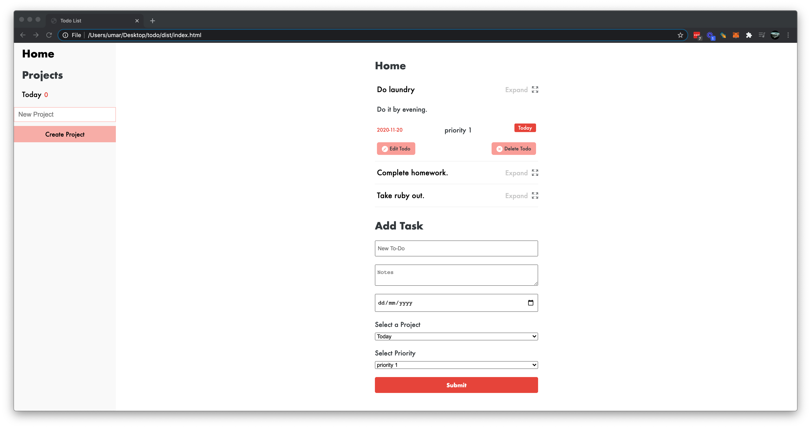

## Todolist Vanilla

> A simple Todolist application made with Vanilla JS. Design interface inspired by Todoist.

## Built with

* Javascript (ES6)
* Sass
* Webpack

## Live Demo

[Live Link](https://raw.githack.com/mohammadumar28/todo-vanilla/todo-vanilla/dist/index.html)

## How To run the Project

* Open Terminal/Command line
1. Run `git clone https://github.com/mohammadumar28/todo-vanilla.git` to clone the project.
2. Run `npm install` to install node modules.
3. Open `dist/index.html` in a browser.

## Authors

**Muhammad Umar**
- Github: [@mohammadumar28](https://github.com/mohammadumar28)
- LinkedIn: [Mohammad Umar](https://www.linkedin.com/in/mohammadumar28/)
- Twitter: [@Mohammadumar28](https://twitter.com/Mohammadumar28)
- Email: [mohammadumar28@gmail.com](mailto:mohammadumar28@gmail.com)

## Acknowledgements

* [The Odin Project](https://www.theodinproject.com/courses/javascript/lessons/restaurant-page)
* [Microverse](https://microverse.org)

## Contribution

* Fork this repo.
* Create your feature branch `git checkout -b my-new-feature`.
* Commit your changes `git commit -am "Add some feature"`.
* Push to the branch `git push origin my-new-feature`.
* Create a new Pull Request.